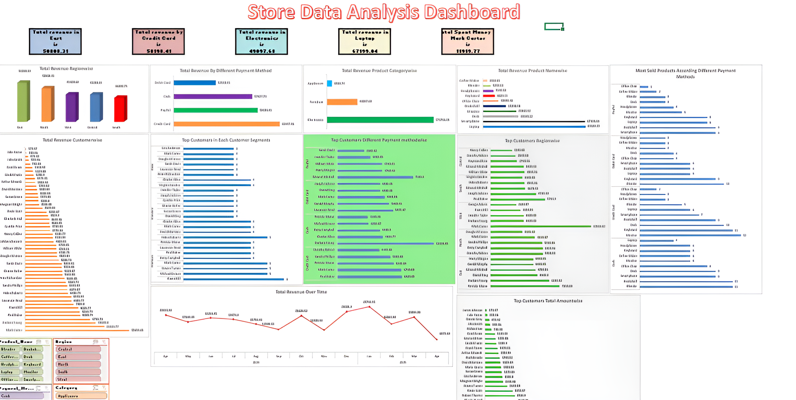

## 🖼️ Preview

# 🏬 Store Data Analysis Dashboard
An interactive dashboard to analyze revenue by region, product category, customer segments, and payment methods.

---

## 📊 Key Features
- Total Revenue by Region, Product, and Customer
- Revenue Distribution by Payment Methods
- Top Performing Customers and Segments
- Revenue Trend Over Time
- Product-Wise Sales Analysis
- Interactive visual filters by Region, Product, Payment Method, and Time

---

## 🛠️ Tools Used
- Excel (Pivot Tables, Bar & Line Charts, Slicers)

---

## 📌 Insights
- Highest Revenue: Laptop Category – \$67,199.04  
- Top Region: East – \$50,808.31  
- Leading Payment Method: Credit Card – \$51,189.41  
- Most Spent by Customer: Mark Carter – \$11,919.77  
- Sales show monthly cyclic trends
